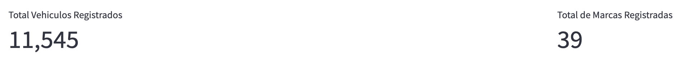
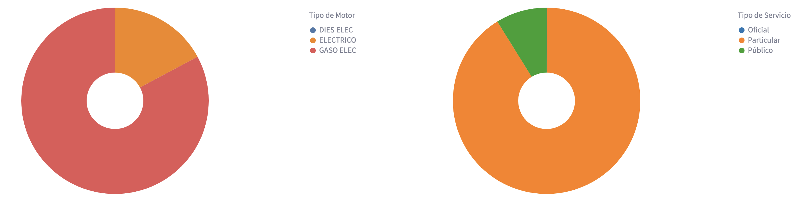
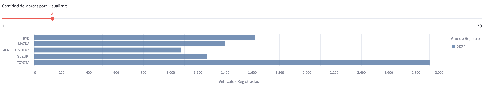
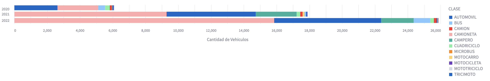

# Dashboard: Vehiculos Electricos e Hibridos Registrados en Colombia.

El siguiente Dashboar muestra los carros electricos e hibridos registrados en Colombia.

Puede realizar filtro por Ciudad y/o Año. También visualizar todas las ciudades y todos los años del documento.


Se puede observar de forma rápida la cantidad de vehiculos registrados y la cantidad de marcas registradas.



Muestra la inforamción de Clasificación de Vehiculos por tipo de motor y por el tipo de servicio que prestan.



Se incluyo un filtro para mostrar las Marcas de carros con más cantidad de vehiculos registrados.



Y por último se puede visualizar la Clase de vehiculos registrados y el total por año.



## Jupyter

Se utilizo Jupyter-Lab para organizar los datos que se iban a visualizar en el Dashboard.

```bash
jupyter-lab
```

## Streamlit

Se utiliza Streamlit como herramienta para generar el Dashboard al igual que para publicarlo en internet.

Para iniciar el dashboard en entorno local se puede utilizar:

```bash
streamlit run app.py
```

## Recursos

Para visualizar el Dashboard en linea puede acceder al siguiente link.

[Dashboar URL](https://kannder83-dashboard-streamlit-app-ydneac.streamlit.app/)

Los datos para realizar el Dashboard fueron tomados de la siguiente página.

[Datos CSV](https://www.datos.gov.co/Transporte/Numero-de-Veh-culos-El-ctricos-Hibridos/7qfh-tkr3)
